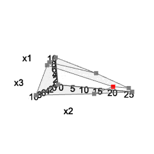

<!-- README.md is generated from README.Rmd. Please edit that file -->

<!-- badges: start -->

[](https://CRAN.R-project.org/package=gMOIP)
[](http://cranlogs.r-pkg.org/downloads/total/last-month/gMOIP)
[](https://github.com/relund/gMOIP/actions)
<!-- badges: end -->

# Tools for 2D and 3D plots of single and multi-objective linear/integer programming models

The `gMOIP` package can be used to make 2D and 3D plots of linear
programming (LP), integer linear programming (ILP), or mixed integer
linear programming (MILP) models with up to three objectives. This
include the polytope, integer points, ranges and iso profit curve. Plots
of both the solution and criterion space are possible. For instance the
non-dominated (Pareto) set for bi-objective LP/ILP/MILP programming
models.

The package also include an `inHull` function for checking if a set of
points is inside/at/outside the convex hull of a set of vertices (for
arbitrary dimension).

Finally, the package also contains functions for generating
(non-dominated) points in \(\mathbb{R}_n\) and classifying non-dominated
points as supported extreme, supported non-extreme and unsupported.

## Usage

Consider the model \(\max\{cx | Ax \leq b\}\) (could also be minimized)
with 2 variables:

``` r
A <- matrix(c(-3,2,2,4,9,10), ncol = 2, byrow = TRUE)
b <- c(3,27,90)
coeff <- c(7.75, 10)  # coefficients c
```

The polytope of the LP model with non-negative continuous variables
(\(x \geq 0\)):

``` r
plotPolytope(
   A,
   b,
   coeff,
   type = rep("c", ncol(A)),
   crit = "max",
   faces = rep("c", ncol(A)),
   plotFaces = TRUE,
   plotFeasible = TRUE,
   plotOptimum = TRUE,
   labels = "coord"
)
```


The polytope of the ILP model with LP faces (\(x\in \mathbb{Z}_0\)):

``` r
plotPolytope(
   A,
   b,
   coeff,
   type = rep("i", ncol(A)),
   crit = "max",
   faces = rep("c", ncol(A)),
   plotFaces = TRUE,
   plotFeasible = TRUE,
   plotOptimum = TRUE,
   labels = "coord"
)
```


The polytope of the MILP model (first variable integer) with LP faces:

``` r
plotPolytope(
   A,
   b,
   coeff,
   type = c("i", "c"),
   crit = "max",
   faces = c("c", "c"),
   plotFaces = TRUE,
   plotFeasible = TRUE,
   plotOptimum = TRUE,
   labels = "coord"
)
```


You can do the same with three variables:

``` r
A <- matrix( c(
   3, 2, 5,
   2, 1, 1,
   1, 1, 3,
   5, 2, 4
), nc = 3, byrow = TRUE)
b <- c(55, 26, 30, 57)
coeff <- c(20, 10, 15)
```

``` r
# LP model
view <- matrix( c(-0.412063330411911, -0.228006735444069, 0.882166087627411, 0, 0.910147845745087,
                  -0.0574885793030262, 0.410274744033813, 0, -0.042830865830183, 0.97196090221405,
                  0.231208890676498, 0, 0, 0, 0, 1), nc = 4)   
loadView(v = view)  # set view angle
plotPolytope(A, b, plotOptimum = TRUE, obj = coeff, labels = "n")
```

<center>



</center>

Note: interactive 3d plots cannot be displayed in a github README file,
and static images or animated gifs are used here instead. Visit the
[pkgdown online documentation](https://relund.github.io/gMOIP/) to view
plots which can be manipulated in the browser.

For more examples see `example("gMOIP-package")` or
`browseVignettes('gMOIP')`.

## LaTeX support

You may create a TikZ file of the plot for LaTeX using

``` r
library(tikzDevice)
tikz(file = "plot_polytope.tex", standAlone=F, width = 7, height = 6)
plotPolytope(
   A,
   b,
   coeff,
   type = rep("i", ncol(A)),
   crit = "max",
   faces = rep("c", ncol(A)),
   plotFaces = TRUE,
   plotFeasible = TRUE,
   plotOptimum = TRUE,
   labels = "coord"
)
dev.off()
```

## Installation

Install the latest stable release from CRAN:

``` r
install.packages("gMOIP")
```

Alternatively, install the latest development version from GitHub
(recommended):

``` r
install.packages("remotes")
remotes::install_github("relund/gMOIP")

library(gMOIP)
browseVignettes('gMOIP')
example("gMOIP-package")
```
