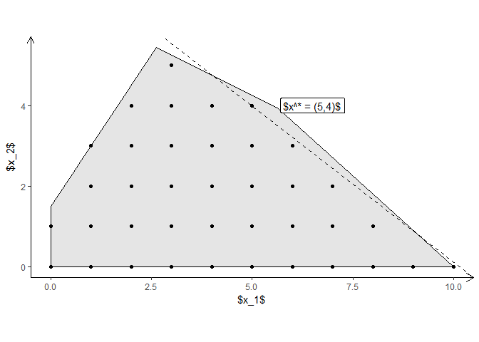
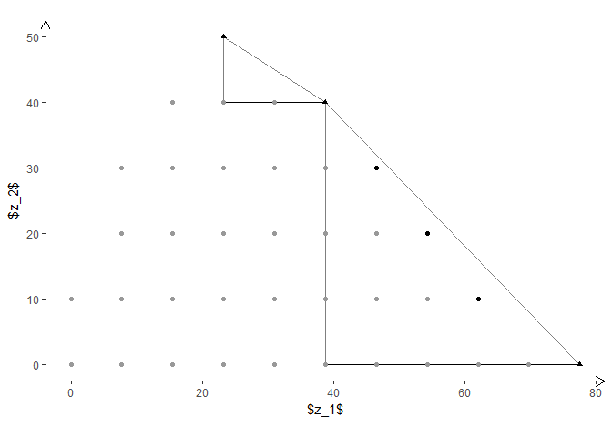

<!-- README.md is generated from README.Rmd. Please edit that file -->
[](https://travis-ci.org/relund/gMOIP) [](https://CRAN.R-project.org/package=gMOIP) [](http://cranlogs.r-pkg.org/downloads/total/last-month/gMOIP)

gMOIP - 2D plots of LP/IP programming models
============================================

Make 2D plots of the polyeder of a linear programming (LP) or integer programming (IP) model, including integer points and iso profit curve. Can also make a plot of a bi-objective criterion space and the non-dominated (Pareto) set.

Usage
-----

``` r
# Define the LP max/min coeff*x st. Ax<=b, x>=0
A <- matrix(c(9,10,2,4,-3,2), ncol = 2, byrow = TRUE)
b <- c(90,27,3)
coeff <- c(7.75, 10)

# Corner points of the polytope
cPoints<-cornerPoints(A, b)
# Integer points in the polytope
iPoints<-integerPoints(A, b)
# plot polytope (ggplot2)
plotPolytope(cPoints, iPoints, iso = coeff, crit = "max")
```



``` r
# Plot of criterion points given a bi-objective vector
zPoints<-criterionPoints(iPoints, c1 = c(coeff[1], 0), c2 = c(0, coeff[2]), crit = "max")
plotCriterion(zPoints, addHull = FALSE, addTriangles = TRUE)
```



For more examples see `example("gMOIP-package")` or my [blog post](http://www.research.relund.dk/?p=671). You may also create a tikz file of the plot for LaTeX using

``` r
library(tikzDevice)
tikz(file = "plot_polytope.tex", standAlone=F, width = 7, height = 6)
plotPolytope(cPoints, zPoints, showLbl = TRUE)
dev.off()
```

Installation
------------

Install the latest stable release from CRAN:

``` r
install.packages("gMOIP")
```

Alternatively, install the latest development version from GitHub:

``` r
install.packages("devtools")
devtools::install_github("relund/gMOIP")

library(gMOIP)
example("gMOIP-package")
```
