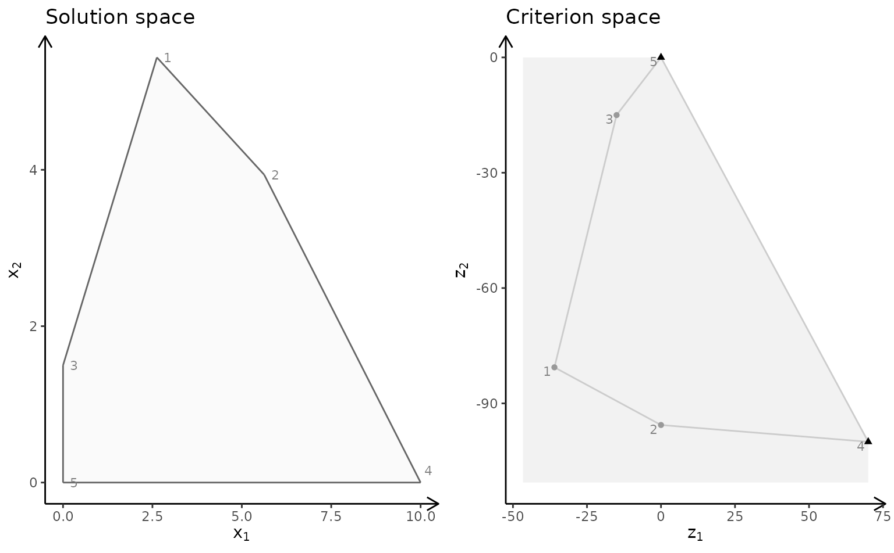
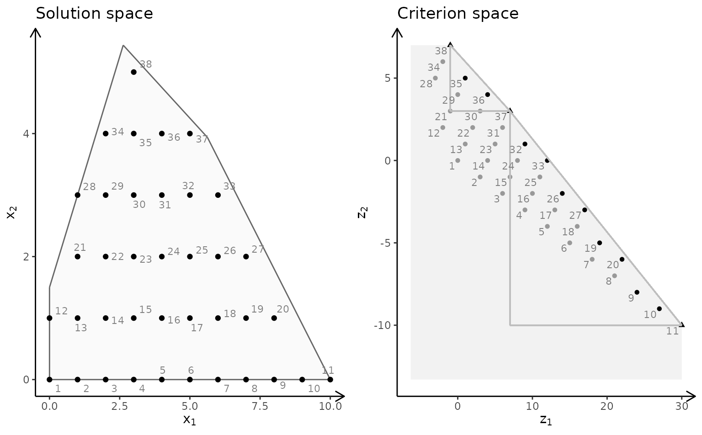
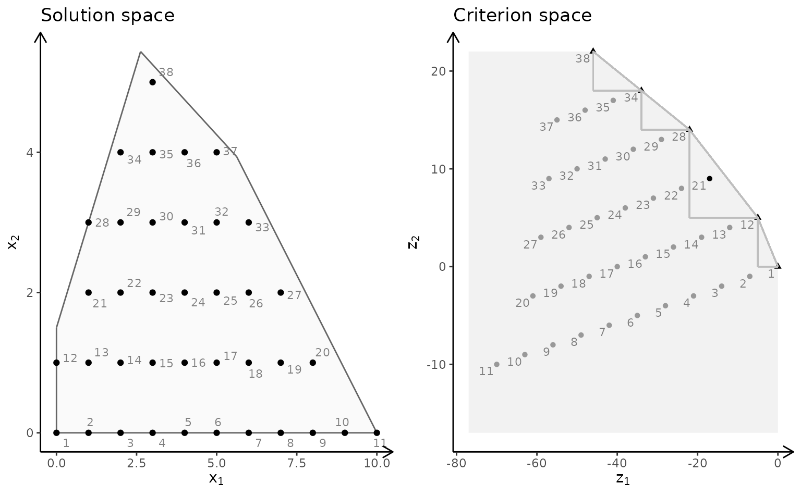
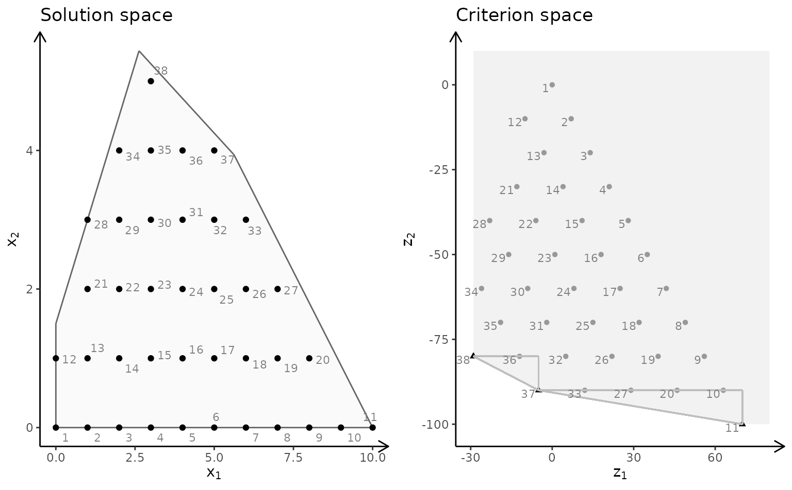
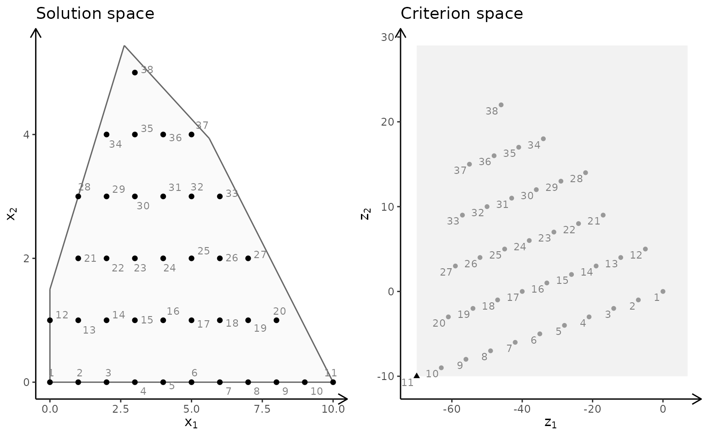
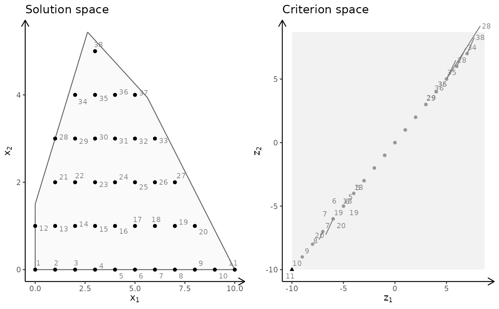
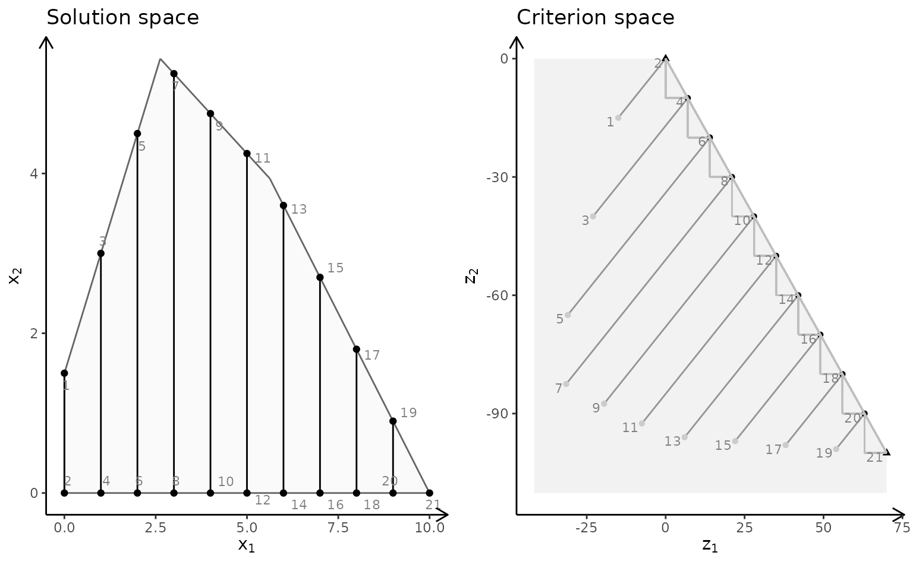
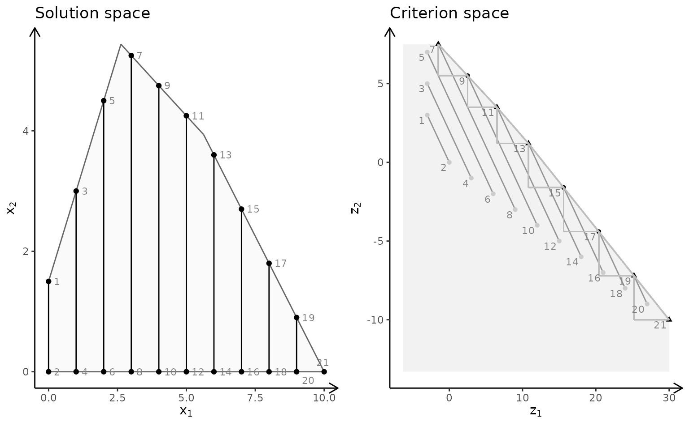
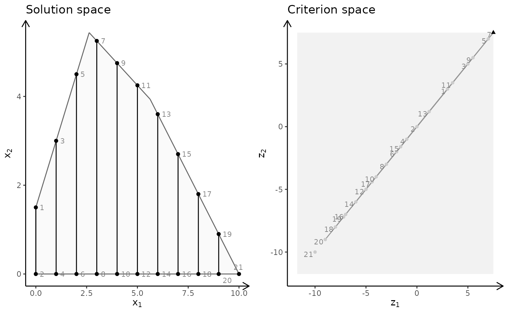
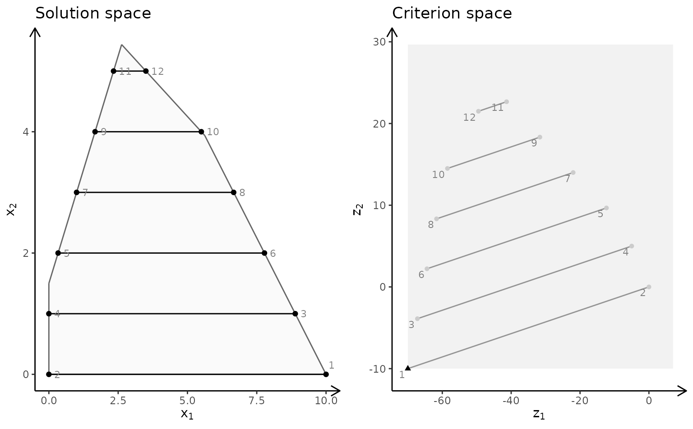

# Plotting bi-objective models with two variables

With `gMOIP` you can make plots of the criterion space for bi-objective
models (linear programming (LP), integer linear programming (ILP), or
mixed integer linear programming (MILP)). This vignette gives examples
on how to make plots of both the solution and criterion space.

First we load the package:

``` r
library(gMOIP)
```

We define a function for grouping plots of the solution and criterion
space:

``` r
plotBiObj2D <- function(A, b, obj,
   type = rep("c", ncol(A)),
   crit = "max",
   faces = rep("c", ncol(A)),
   plotFaces = TRUE,
   plotFeasible = TRUE,
   plotOptimum = FALSE,
   labels = "numb",
   addTriangles = TRUE,
   addHull = TRUE)
{
   p1 <- plotPolytope(A, b, type = type, crit = crit, faces = faces, plotFaces = plotFaces,
                      plotFeasible = plotFeasible, plotOptimum = plotOptimum, labels = labels) + 
      ggplot2::ggtitle("Solution space")
   p2 <- plotCriterion2D(A, b, obj, type = type, crit = crit, addTriangles = addTriangles,
                         addHull = addHull, plotFeasible = plotFeasible, labels = labels) +
      ggplot2::ggtitle("Criterion space")
   gridExtra::grid.arrange(p1, p2, nrow = 1) 
}
```

Let us define the constraints:

``` r
A <- matrix(c(-3,2,2,4,9,10), ncol = 2, byrow = TRUE)
b <- c(3,27,90)
```

First let us have a look at a LP model:

``` r
obj <- matrix(
   c(7, -10, # first criterion
     -10, -10), # second criterion
   nrow = 2)
plotBiObj2D(A, b, obj, addTriangles = FALSE)
```



Note the non-dominated (Pareto) set consists of all supported extreme
non-dominated points (illustrated with triangles) and the line segments
between them.

ILP models with different criteria (maximize):

``` r
obj <- matrix(c(7, -10, -10, -10), nrow = 2)
plotBiObj2D(A, b, obj, type = rep("i", ncol(A)))
```


``` r
obj <- matrix(c(3, -1, -2, 2), nrow = 2)
plotBiObj2D(A, b, obj, type = rep("i", ncol(A)))
```



``` r
obj <- matrix(c(-7, -1, -5, 5), nrow = 2)
plotBiObj2D(A, b, obj, type = rep("i", ncol(A)))
```



``` r
obj <- matrix(c(-1, -1, 2, 2), nrow = 2)
plotBiObj2D(A, b, obj, type = rep("i", ncol(A)))
```


Note the non-dominated set consists of all points in black (with shape
supported extreme:triangle, supported non-extreme:round,
unsupported:round (not on the border)). The triangles drawn using the
extreme non-dominated points illustrate areas where unsupported
non-dominated points may be found. A point in the solution space is
identified in the criterion space using the same number.

ILP models with different criteria (minimize):

``` r
obj <- matrix(c(7, -10, -10, -10), nrow = 2)
plotBiObj2D(A, b, obj, type = rep("i", ncol(A)), crit = "min")
```



``` r
obj <- matrix(c(3, -1, -2, 2), nrow = 2)
plotBiObj2D(A, b, obj, type = rep("i", ncol(A)), crit = "min")
```


``` r
obj <- matrix(c(-7, -1, -5, 5), nrow = 2)
plotBiObj2D(A, b, obj, type = rep("i", ncol(A)), crit = "min")
```



``` r
obj <- matrix(c(-1, -1, 2, 2), nrow = 2)
plotBiObj2D(A, b, obj, type = rep("i", ncol(A)), crit = "min")
```



MILP model ($x_{1}$ integer) with different criteria (maximize):

``` r
obj <- matrix(c(7, -10, -10, -10), nrow = 2)
plotBiObj2D(A, b, obj, type = c("i", "c"))
```



``` r
obj <- matrix(c(3, -1, -2, 2), nrow = 2)
plotBiObj2D(A, b, obj, type = c("i", "c"))
```



``` r
obj <- matrix(c(-7, -1, -5, 5), nrow = 2)
plotBiObj2D(A, b, obj, type = c("i", "c"))
```


``` r
obj <- matrix(c(-1, -1, 2, 2), nrow = 2)
plotBiObj2D(A, b, obj, type = c("i", "c"))
```



Note the solution space now consists to segments and hence the
non-dominated set may consist of points and segments (open and closed).
Note these segments are not highlighted in the current version of
`gMOIP`.

MILP model ($x_{2}$ integer) with different criteria (minimize):

``` r
## 
obj <- matrix(c(7, -10, -10, -10), nrow = 2)
plotBiObj2D(A, b, obj, type = c("c", "i"), crit = "min")
```


``` r
obj <- matrix(c(3, -1, -2, 2), nrow = 2)
plotBiObj2D(A, b, obj, type = c("c", "i"), crit = "min")
```


``` r
obj <- matrix(c(-7, -1, -5, 5), nrow = 2)
plotBiObj2D(A, b, obj, type = c("c", "i"), crit = "min")
```



``` r
obj <- matrix(c(-1, -1, 2, 2), nrow = 2)
plotBiObj2D(A, b, obj, type = c("c", "i"), crit = "min")
```


## Saving plots to LaTeX

If you write a paper using LaTeX, you may create a TikZ file of the plot
for LaTeX using

``` r
library(tikzDevice)
tikz(file = "plot_polytope.tex", standAlone=F, width = 7, height = 6)
plotPolytope(
   A,
   b,
   obj,
   type = rep("i", ncol(A)),
   crit = "max",
   faces = rep("c", ncol(A)),
   plotFaces = TRUE,
   plotFeasible = TRUE,
   plotOptimum = TRUE,
   labels = "n",
   latex = TRUE
)
dev.off()
```
