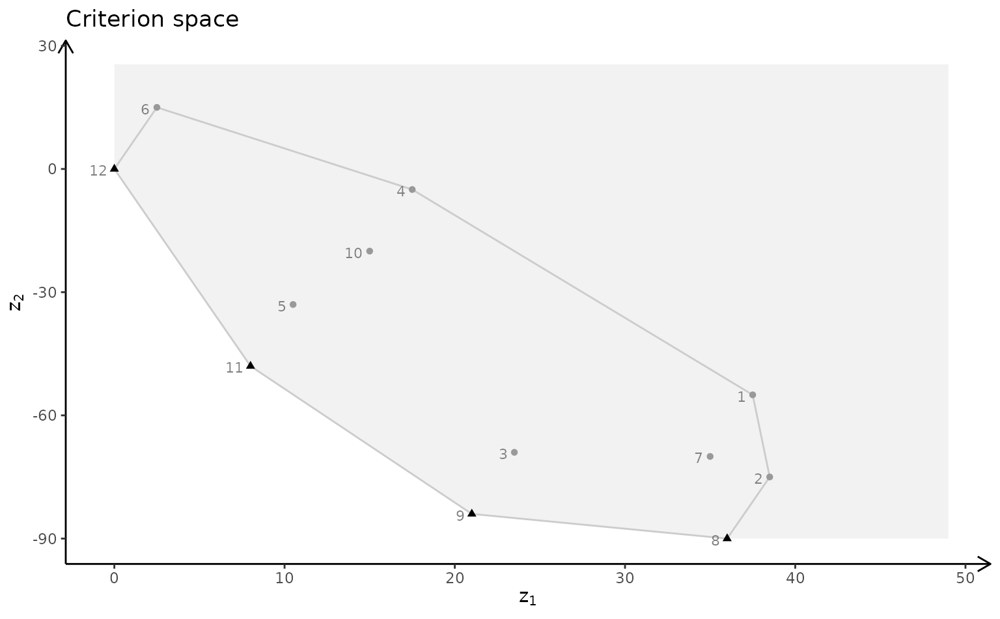
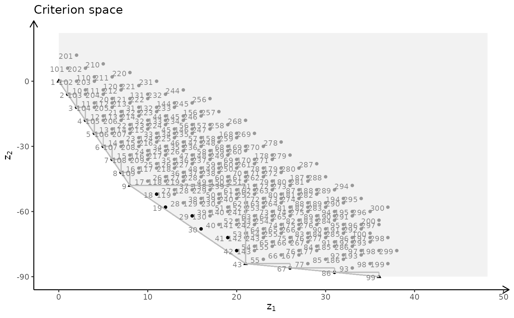
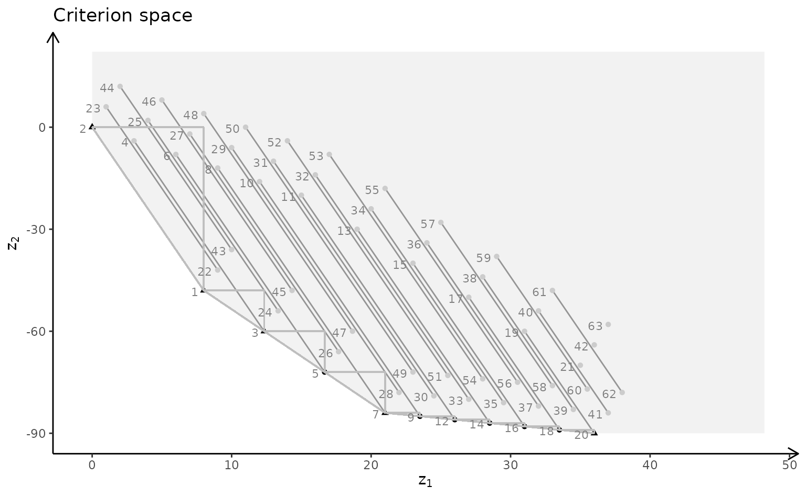
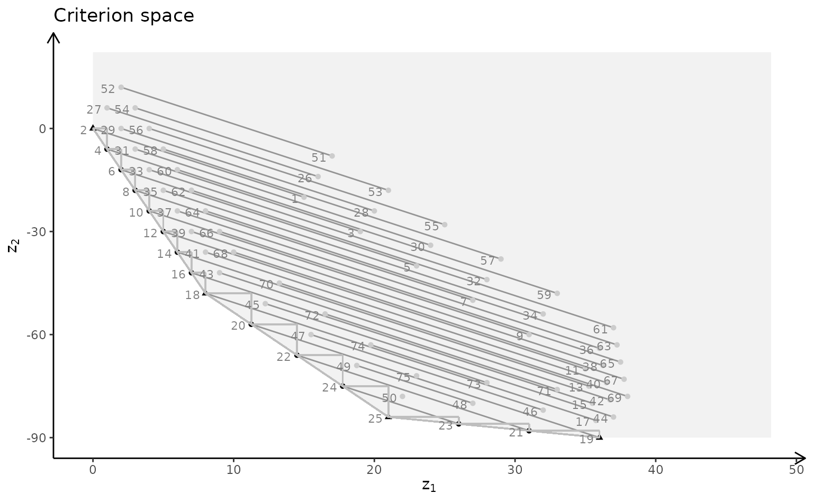
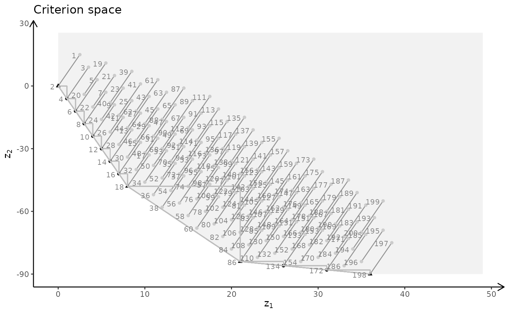
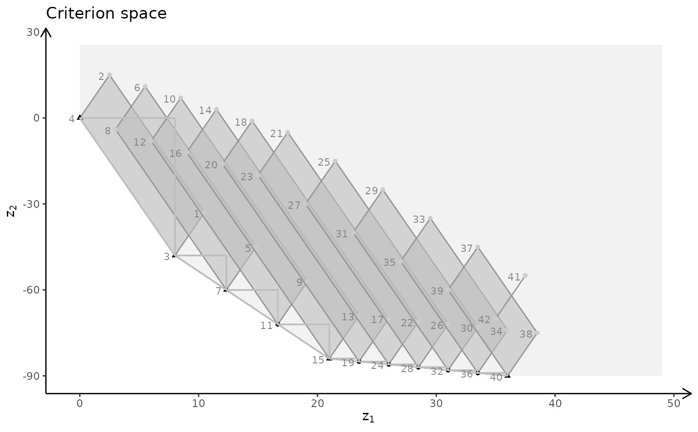

# Plotting bi-objective models with three variables - Example 2

With `gMOIP` you can make plots of the criterion space for bi-objective
models (linear programming (LP), integer linear programming (ILP), or
mixed integer linear programming (MILP)). This vignette gives examples
on how to make plots of both the solution and criterion space.

First we load the package:

``` r
library(gMOIP)
```

We define functions for plotting the solution and criterion space:

``` r
plotSol <- function(A, b, type = rep("c", ncol(A)),
                        faces = rep("c", ncol(A)),
                        plotFaces = TRUE, labels = "numb")
{
   #loadView(v = view, close = F, zoom = 0.75)
   plotPolytope(A, b, type = type, faces = faces, labels = labels, plotFaces = plotFaces, 
                argsTitle3d = list(main = "Solution space"))
}

plotCrit <- function(A, b, obj, crit = "min", type = rep("c", ncol(A)), addTriangles = TRUE, 
                     labels = "numb") 
{
    plotCriterion2D(A, b, obj, type = type, crit = crit, addTriangles = addTriangles, 
                   labels = labels) + 
      ggplot2::ggtitle("Criterion space")
}
```

We define the model $\max\{ cx|Ax \leq b\}$ (could also be minimized)
with three variables:

``` r
A <- matrix( c(
   -1, 1, 0,
   1, 4, 0,
   2, 1, 0,
   3, -4, 0,
   0, 0, 4
), nc = 3, byrow = TRUE)
b <- c(5, 45, 27, 24, 10)
obj <- matrix(c(1, -6, 3, -4, 1, 6), nrow = 2)
```

We load the preferred view angle for the RGL window:

``` r
view <- matrix( c(0.976349174976349, -0.202332556247711, 0.0761845782399178, 0, 0.0903248339891434,
                  0.701892614364624, 0.706531345844269, 0, -0.196427255868912, -0.682940244674683,
                  0.703568696975708, 0, 0, 0, 0, 1), nc = 4)
loadView(v = view)
```

LP model (solution space):

``` r
plotSol(A, b)
```

LP model (criterion space):

``` r
plotCrit(A, b, obj, addTriangles = FALSE) 
```



ILP model (solution space):

``` r
plotSol(A, b, type = c("i","i","i"))
```

ILP model (criterion space):

``` r
plotCrit(A, b, obj, type = c("i","i","i"))
```



MILP model with variable 2 and 3 integer (solution space):

``` r
plotSol(A, b, type = c("c","i","i"))
```

MILP model with variable 2 and 3 integer (criterion space):

``` r
plotCrit(A, b, obj, type = c("c","i","i"))
```



MILP model with variable 1 and 3 integer (solution space):

``` r
plotSol(A, b, type = c("i","c","i"), plotFaces = FALSE)
```

MILP model with variable 1 and 3 integer (criterion space):

``` r
plotCrit(A, b, obj, type = c("i","c","i"))
```



MILP model with variable 1 and 2 integer (solution space):

``` r
plotSol(A, b, type = c("i","i","c"))
```

MILP model with variable 1 and 2 integer (criterion space):

``` r
plotCrit(A, b, obj, type = c("i","i","c"))
```



MILP model with variable 1 integer (solution space):

``` r
plotSol(A, b, type = c("i","c","c"), plotFaces = F)
```

MILP model with variable 1 integer (criterion space):

``` r
plotCrit(A, b, obj, type = c("i","c","c"))
```


MILP model with variable 2 integer (solution space - interactive plot):

``` r
plotSol(A, b, type = c("c","i","c"), plotFaces = F)
```

MILP model with variable 2 integer (criterion space):

``` r
plotCrit(A, b, obj, type = c("c","i","c"))
```



MILP model with variable 3 integer (solution space):

``` r
plotSol(A, b, type = c("c","c","i"))
```

MILP model with variable 3 integer (criterion space):

``` r
plotCrit(A, b, obj, type = c("c","c","i"))
```


