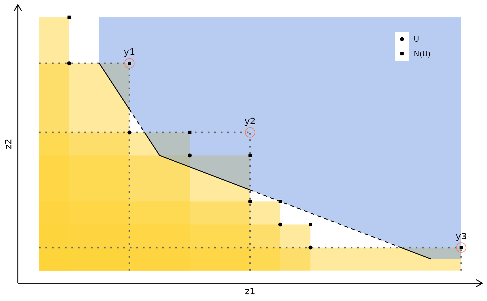

# Shapes in multi-objective programming

Package `gMOIP` has different features for plotting different shapes in
3D.

We define the sets
${\mathbb{R}}_{>} = \{ z \in {\mathbb{R}} \mid z > 0\}$,
${\mathbb{R}}_{\geqq} = \{ z \in {\mathbb{R}} \mid z \geqq 0\}$ and
${\mathbb{R}}_{\geq} = \{ z \in {\mathbb{R}} \mid z \geq 0\}$:

The non-dominated set (red points are non-dominated and black
dominated):

We may also add dominance cones and the hull:

Note the area between the hull and the cones is the search area where
further nondominated points may be found.

Another example with more unsupported points:

We may also plot reverse dominance cones:

Given a lower bound set $L$ (the line segments) and an upper bound set
$U$ with local upper bounds $N(U)$, the search region $A$ is given by
the closure of the gray area:

A lower bound set (solid and dashed lines) partially dominated by the
upper bound set. The dominated area of the lower bound set is
represented by the dashed lines. Three disjoint subproblems are created
in the objective space by applying objective branching on $y1$, $y2$ and
$y3$, represented by the red circles. The constraints added when
applying objective branching are represented by the dotted lines. A new
non-dominated point feasible for the corresponding problem can only be
found in one of these subproblems (gray areas):

Bi-objective case: The dominated part of the lower bound set is
represented by the dashed line. When objective branching is applied on
each local upper bound, the search areas (gray) are disjoint:

Three-objective case: The dominated part of the lower bound set is the
blue area in the middle. When objective branching is applied on each
local upper bound, there are redundancies between the subproblems (each
subproblem defines a gray search area). Every point in the red areas is
included in the search area of more than one subproblem:

Lower bound set (hyperplane) partially dominated by the upper bound set
(black points with red dominance cones). Note the two disjoint search
areas above the hyperplane:

Objective branching applied to $y^{1}$ and $y^{2}$. One subproblem is
fully included in the other subproblem:

Another view:
