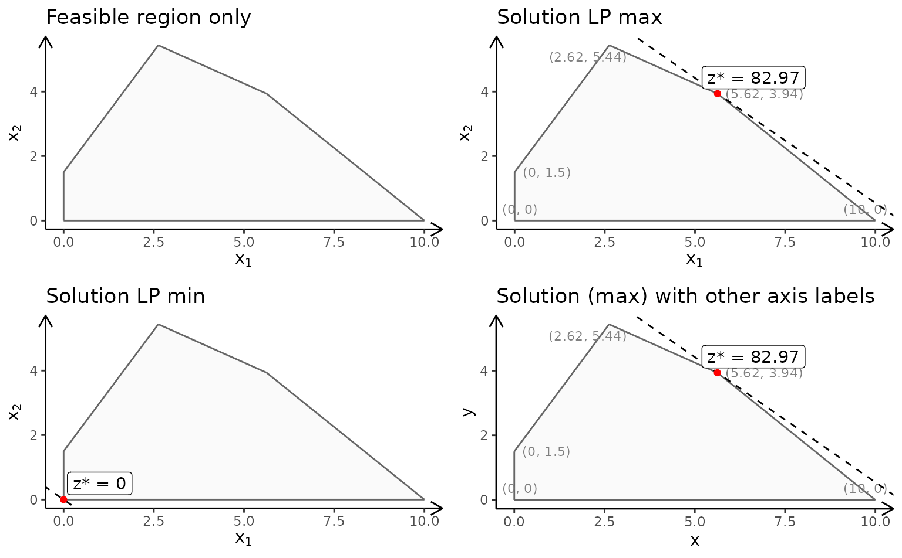
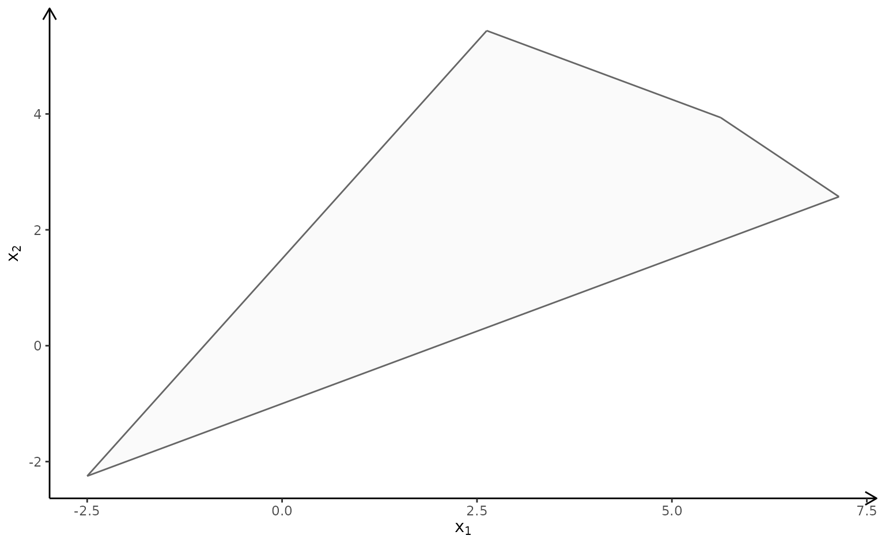

# Plotting polytopes in 2D

With `gMOIP` you can make 2D plots of the the polytope/feasible
region/solution space of a linear programming (LP), integer linear
programming (ILP) model, or mixed integer linear programming (MILP)
model. This vignette gives examples on how to make plots given a model
with two variables.

First we load the package:

``` r
library(gMOIP)
```

We define the model $\max\{ cx|Ax \leq b\}$ (could also be minimized)
with 2 variables:

``` r
A <- matrix(c(-3,2,2,4,9,10), ncol = 2, byrow = TRUE)
b <- c(3,27,90)
obj <- c(7.75, 10)  # coefficients c
```

Plots are created using function `plotPolytope` which outputs a
`ggplot2` object.

## LP model

Let us consider different plots of the polytope of the LP model with
non-negative variables ($x \in {\mathbb{R}}_{0},x \geq 0$):

``` r
# The polytope with the corner points
p1 <- plotPolytope(
   A,
   b,
   obj,
   type = rep("c", ncol(A)),
   crit = "max",
   faces = rep("c", ncol(A)),
   plotFaces = TRUE,
   plotFeasible = TRUE,
   plotOptimum = FALSE,
   labels = NULL
) + ggplot2::ggtitle("Feasible region only")

p2 <- plotPolytope(
   A,
   b,
   obj,
   type = rep("c", ncol(A)),
   crit = "max",
   faces = rep("c", ncol(A)),
   plotFaces = TRUE,
   plotFeasible = TRUE,
   plotOptimum = TRUE,
   labels = "coord"
) + ggplot2::ggtitle("Solution LP max")

p3 <- plotPolytope(
   A,
   b,
   obj,
   type = rep("c", ncol(A)),
   crit = "min",
   faces = rep("c", ncol(A)),
   plotFaces = TRUE,
   plotFeasible = TRUE,
   plotOptimum = TRUE,
   labels = "n"
) + ggplot2::ggtitle("Solution LP min")

p4 <- plotPolytope(
   A,
   b,
   obj,
   type = rep("c", ncol(A)),
   crit = "max",
   faces = rep("c", ncol(A)),
   plotFaces = TRUE,
   plotFeasible = TRUE,
   plotOptimum = TRUE,
   labels = "coord"
) + ggplot2::xlab("x") + ggplot2::ylab("y") + ggplot2::ggtitle("Solution (max) with other axis labels")

gridExtra::grid.arrange(p1, p2, p3, p4, nrow = 2)
```



You may also consider a LP model with no non-negativity constraints:

``` r
A <- matrix(c(-3, 2, 2, 4, 9, 10, 1, -2), ncol = 2, byrow = TRUE)
b <- c(3, 27, 90, 2)
obj <- c(7.75, 10)
plotPolytope(
   A,
   b,
   obj,
   type = rep("c", ncol(A)),
   nonneg = rep(FALSE, ncol(A)),
   crit = "max",
   faces = rep("c", ncol(A)),
   plotFaces = TRUE,
   plotFeasible = TRUE,
   plotOptimum = FALSE,
   labels = NULL
)
```



Note The package don’t plot feasible regions that are unbounded e.g if
we drop the second and third constraint we get the wrong plot:

``` r
A <- matrix(c(-3,2), ncol = 2, byrow = TRUE)
b <- c(3)
obj <- c(7.75, 10)
# Wrong plot
plotPolytope(
   A,
   b,
   obj,
   type = rep("c", ncol(A)),
   crit = "max",
   faces = rep("c", ncol(A)),
   plotFaces = TRUE,
   plotFeasible = TRUE,
   plotOptimum = FALSE,
   labels = NULL
)
```


One solution is to add a bounding box and check if the bounding box is
binding

``` r
A <- rbind(A, c(1,0), c(0,1))
b <- c(b, 10, 10)
plotPolytope(
   A,
   b,
   obj,
   type = rep("c", ncol(A)),
   crit = "max",
   faces = rep("c", ncol(A)),
   plotFaces = TRUE,
   plotFeasible = TRUE,
   plotOptimum = FALSE,
   labels = NULL
)
```


You may also use e.g `lpsolve` to check if the solution is unbounded.

## ILP model

If we add integer constraints to the model ($x \in {\mathbb{Z}}$) you
may view the feasible region different ways:

``` r
A <- matrix(c(-3,2,2,4,9,10), ncol = 2, byrow = TRUE)
b <- c(3,27,90)
obj <- c(7.75, 10)

p1 <- plotPolytope(
   A,
   b,
   obj,
   type = rep("i", ncol(A)),
   crit = "max",
   faces = rep("c", ncol(A)),
   plotFaces = TRUE,
   plotFeasible = TRUE,
   plotOptimum = FALSE,
   labels = "n"
) + ggplot2::ggtitle("Relaxed region with LP faces")

p2 <- plotPolytope(
   A,
   b,
   obj,
   type = rep("i", ncol(A)),
   crit = "max",
   faces = rep("i", ncol(A)),
   plotFaces = TRUE,
   plotFeasible = TRUE,
   plotOptimum = FALSE,
   labels = "n"
) + ggplot2::ggtitle("Relaxed region with IP faces")

p3 <- plotPolytope(
   A,
   b,
   obj,
   type = rep("i", ncol(A)),
   crit = "max",
   faces = rep("c", ncol(A)),
   plotFaces = TRUE,
   plotFeasible = TRUE,
   plotOptimum = TRUE,
   labels = "n"
) + ggplot2::ggtitle("Optimal solution (max)")

p4 <- plotPolytope(
   A,
   b,
   obj = c(-3, 3),
   type = rep("i", ncol(A)),
   crit = "max",
   faces = rep("i", ncol(A)),
   plotFaces = TRUE,
   plotFeasible = TRUE,
   plotOptimum = TRUE,
   labels = "n"
) + ggplot2::ggtitle("Other objective (min)")

gridExtra::grid.arrange(p1, p2, p3, p4, nrow = 2)
```


## MILP model

Finally, let us have a look at a MILP model:

``` r
A <- matrix(c(-3,2,2,4,9,10), ncol = 2, byrow = TRUE)
b <- c(3,27,90)
obj <- c(7.75, 10)

p1 <- plotPolytope(
   A,
   b,
   obj,
   type = c("c", "i"),
   crit = "max",
   faces = c("c", "c"),
   plotFaces =  TRUE,
   plotFeasible = TRUE,
   plotOptimum = TRUE,
   labels = "n"
) + ggplot2::ggtitle("Second coordinate integer (LP faces)")

p2 <- plotPolytope(
   A,
   b,
   obj,
   type = c("c", "i"),
   crit = "max",
   faces = c("c", "i"),
   plotFaces =  TRUE,
   plotFeasible = TRUE,
   plotOptimum = TRUE,
   labels = "coord"
) + ggplot2::ggtitle("Second coordinate integer (MILP faces)")

p3 <- plotPolytope(
   A,
   b,
   obj,
   type = c("i", "c"),
   crit = "max",
   faces = c("c", "c"),
   plotFaces = TRUE,
   plotFeasible = TRUE,
   plotOptimum = TRUE,
   labels = "n"
) + ggplot2::ggtitle("First coordinate integer (LP faces)")

p4 <- plotPolytope(
   A,
   b,
   obj,
   type = c("i", "c"),
   crit = "max",
   faces = c("i", "c"),
   plotFaces = TRUE,
   plotFeasible = TRUE,
   plotOptimum = TRUE,
   labels = "coord"
) + ggplot2::ggtitle("First coordinate integer (MILP faces)")

gridExtra::grid.arrange(p1, p2, p3, p4, nrow = 2)
```


## Saving plots to LaTeX

If you write a paper using LaTeX, you may create a TikZ file of the plot
for LaTeX using

``` r
library(tikzDevice)
tikz(file = "plot_polytope.tex", standAlone=F, width = 7, height = 6)
plotPolytope(
   A,
   b,
   obj,
   type = rep("i", ncol(A)),
   crit = "max",
   faces = rep("c", ncol(A)),
   plotFaces = TRUE,
   plotFeasible = TRUE,
   plotOptimum = TRUE,
   labels = "n",
   latex = TRUE
)
dev.off()
```
